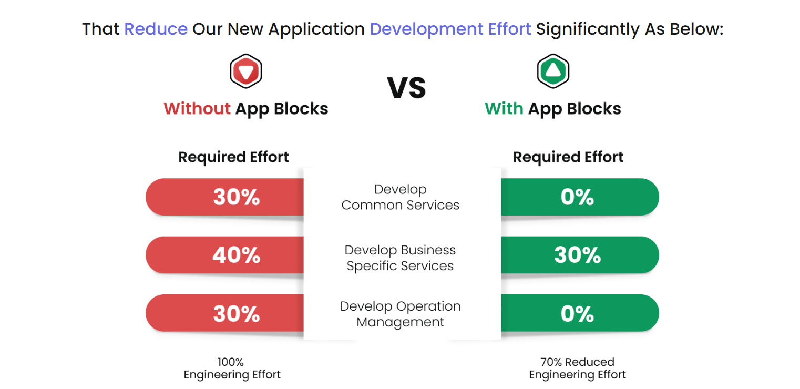

<!-- TOC -->
- [Introduction](#introduction)
- [What we do](#what-we-do)
- [Architecture](#architecture)
  - [Automation Framework](#automation-framework)
  - [Appblocks Framework](#appblocks-framework)
<!-- /TOC -->
# Introduction

Welcome to PTR Technology (https://www.ptrtechnology.com/) git repo.

# What we do

We help business to do "More in Less"

We are writing a catalogue of complete open ,intuitive, reliable, and scalable and flexible software solutions specific to some businesses.The core framework ensures that business enjoy :
    1. Highest Relaiability
    2. Extereme Flexibility
    3. Cost efficient

At the core of our platform we have

   1. An automation framework that provisioning Apps and services seamlessly in multicloud hybrid environments. 
   
   2. A Cloud CMDB that automatically discovers the Apps / Services that is provisioned from our automation framework
   
   3. A SRE platform that automatically establishes all operations dasboards/alerts while we deploy the App itself.
   
   4. A ML-Ops frameowrk that does business specifics AI/ML
   
   5. A App Block framework that help writing cloudnative applications faster.

Our tools/framework would help you to

1. Reduce Operation Management time & Effort @50%
2. Improves product SLE's by 30%
3. Reduce Cloud Capex by 50%
4. Reduce Dev Effort by 50%

# Architecture

##  Automation Framework

## Appblocks Framework

We have focused on creating common services and their lifecycle management that every enterprise application use to do.Most enterprises spent 60% time in writing common services and 40% effort in writing domain specific services. We reduce that 60% effort with the availability of common services and their lifecycle management.

